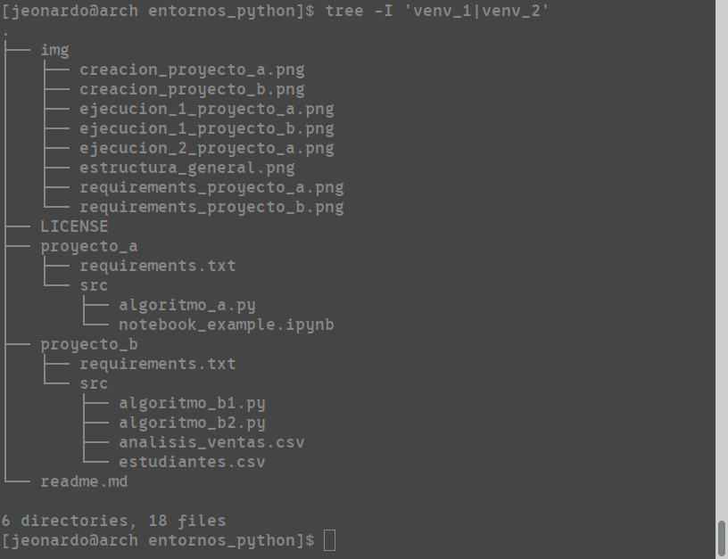

# Practica de entornos virtuales

---

### Version de Python utilizada: 3.13.7

Esta actividad aplica los entornos virtuales *(venv)* de Python, utilizandolos para hacer dos proyectos *(proyecto_a y proyecto_b)* con distintos paquetes cada uno, separados por entornos virtuales.
```

```

---

## Estructura General del proyecto


---
## Clonación y Ejecución
### Esta guía da por hecho que usas Linux o WSL, si estás usando Windows base, el proceso varía ligeramente

### Se recomienda hacer un entorno virtual por cada proyecto

**Clonación del repositorio**
```bash
git clone https://github.com/SrGokuto/python_virtual_enviroments.git
```


---

## Proyecto A
**Creación del entorno virtual e instalación de dependencias**
```bash
cd proyecto_a #Entramos a la carpeta de el proyecto, en este caso, proyecto_a
python -m venv venv_1 #Creamos el entorno virtual 1
source ./venv_1/bin/activate #Activamos dicho entorno virtual
pip install -r requirements.txt #Instalamos dependencias
```

**Ejecución del Script**
```bash
python ./src/algoritmo_a.py
```


**Iniciar Jupyter Lab**
```bash
jupyter-lab
```

**Esto abrirá Jupyter Lab en el navegador por defecto, desde ahí se puede ejecutar el notebook *notebook_example.ipynb* con total normalidad**

---

## Proyecto B

**Creación del entorno virtual e instalación de dependencias**
```bash
cd proyecto_b #Entramos a la carpeta de el proyecto, en este caso, proyecto_b
python -m venv venv_2 #Creamos el entorno virtual 2
source ./venv_2/bin/activate #Activamos dicho entorno virtual
pip install -r requirements.txt #Instalamos dependencias
```

**Ejecución de el Script 1**
```bash
python ./src/algoritmo_b1.py
```
**Ejecución de el Script 2**
```bash
python ./src/algoritmo_b2.py
```


--- 


## Capturas de pantalla

### Creación y activación del entorno virtual e Instalación de Paquetes


### Ejecución de Scripts


### Contenido requirements.txt


### Estructura general del proyecto
